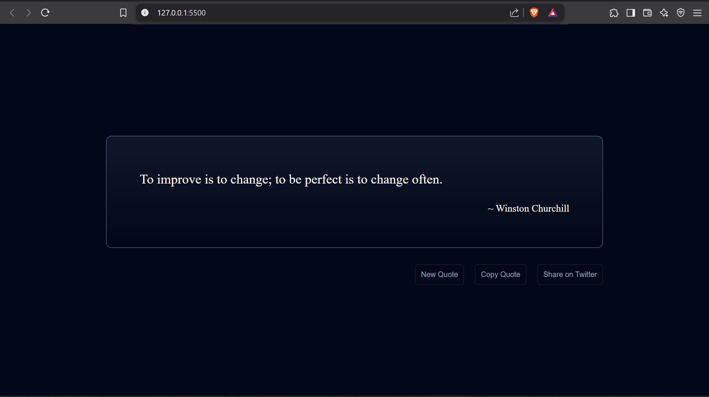

# Quote of the Day

A simple web application that fetches and displays a random quote every time you click the "New Quote" button. Users can also share the quote on Twitter, copy it to their clipboard.

## Features

- **Fetch Random Quote**: Fetches a random quote from the API and displays it with the author’s name.
- **New Quote**: A button that fetches and displays a new random quote each time.
- **Copy to Clipboard**: A button that allows the user to copy the current quote to their clipboard.
- **Share on Twitter**: A button that allows the user to share the current quote on Twitter.


## Screenshots



_Example of how the quote and buttons look in the app._

---

## Technologies Used

- **HTML**: The basic structure of the webpage.
- **CSS**: Styling for the layout, buttons, and overall look of the app.
- **JavaScript**: Fetching quotes from the API, handling button functionality, and interactions with the page.
- **API**: [FreeAPI - Random Quote API](https://api.freeapi.app/api/v1/public/quotes/quote/random).

## How to Use

1. **Clone the Repository**
   ```bash
   git clone https://github.com/vekariaayush04/vigilant-fortnight.git
